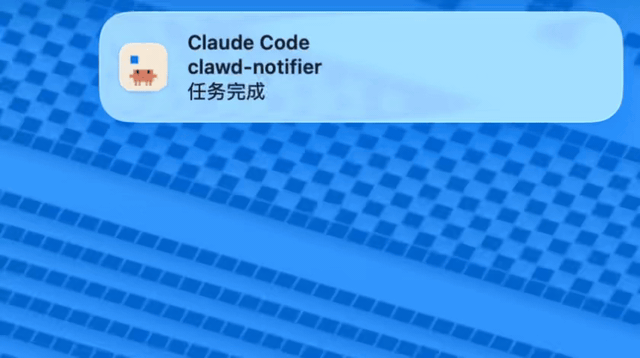

# clawd-notifier

让 macOS 通知弹窗显示 **Clawd**（Claude Code 的像素小螃蟹），每次随机一个姿势。



> 想看高清版（H.264, 无音轨, 394KB）：[`docs/demo.mp4`](docs/demo.mp4)

最初是为了给 Claude Code 的任务完成钩子加点表情，但底层是
[`terminal-notifier`](https://github.com/julienXX/terminal-notifier) 的 macOS bundle 包装——
**任何调用 terminal-notifier 的程序都能用，与终端无关**（Ghostty / iTerm2 / kitty /
Terminal.app / Alacritty 都行）。

## 它做什么

- 把每个 Clawd 姿势独立打包成一个 `.app` bundle（macOS 通知图标在 bundle
  级别缓存，不能在单个 app 内热切换 icns）
- 运行时 wrapper `claude_notify.sh` 从池子里随机抽一个调用 `terminal-notifier`，
  参数原样透传
- 默认面向 Claude Code 的 `Stop` / `Notification` hook，但 wrapper 接受任意
  terminal-notifier 参数——也能给 cron、构建脚本、其他 CLI 工具用（见
  [Beyond Claude Code](#beyond-claude-code)）

效果：Claude 通知你"任务完成"或"需要你确认"时，弹窗左侧的图标每次都不一样
——idle、thinking、typing、happy、building、juggling、sleeping……11 个姿势。

## 安装

需要 macOS + Homebrew。

```bash
git clone https://github.com/ZeoXel/clawd-notifier.git
cd clawd-notifier
./install.sh
```

脚本会：

1. `brew install terminal-notifier` 和 Pillow（如果还没装）
2. 从 [`clawd-on-desk`](https://github.com/rullerzhou-afk/clawd-on-desk) 下载 11 个姿势的 GIF
3. 抽帧 + 合成奶白底 + 打成多分辨率 icns
4. fork `terminal-notifier.app` 成 `~/Applications/ClaudeNotifier-<pose>.app` × 11
5. lsregister 注册全部 bundle
6. 安装 wrapper 到 `~/bin/claude_notify.sh`
7. 打印需要插入 `~/.claude/settings.json` 的 hook 片段（**不会自动改你的配置**）

把 `examples/settings.snippet.json` 里的 `hooks` 段并入你的 `~/.claude/settings.json`
即可。如果你已经有自定义 hook，自己合并一下。

## 自定义

- **想减少姿势池**：`poses.txt` 里把不想要的行注释掉，重跑 `install.sh`
- **想换底色**：在 `lib/compose_icon.py` 里改 `--bg` 默认值（或安装前临时改）
- **bundle ID 前缀**：默认 `com.clawd.notifier`，环境变量 `CLAWD_BUNDLE_PREFIX` 可覆盖
- **GIF 来源**：环境变量 `CLAWD_GIF_BASE_URL` 可指向你自己的镜像

## 跨机同步

默认 **不需要 dotfile 同步**——所有 .app bundle 都在 `~/Applications/`（本地），
wrapper 在 `~/bin/`。每台机器各自跑一次 `./install.sh` 即可。

如果你的 `~/.claude/settings.json` 走 iCloud / chezmoi / stow，那确实要同步——
但 wrapper 和 bundle 路径在不同机器是一致的（都是 `$HOME/bin/...` 和
`$HOME/Applications/...`），无需特殊处理。

## Beyond Claude Code

wrapper 是普通的 `terminal-notifier` 入口，参数原样透传，所以任何场景都能用。
几个例子：

```bash
# 长跑脚本完成提醒
./build.sh && ~/bin/claude_notify.sh -title "Build" -message "done" -sound Glass

# cron / launchd 定时任务
0 18 * * * /path/to/job.sh && ~/bin/claude_notify.sh -message "日报已生成"

# 其他 AI CLI（codex / cursor-cli / aider / 自定义 agent）
codex run task && ~/bin/claude_notify.sh -title "codex" -message "完成"

# git hook（pre-push 跑一遍测试通知一下）
npm test && ~/bin/claude_notify.sh -title "$(basename $PWD)" -message "tests passed"

# tmux / 远程 SSH 通知
ssh server 'long-running-job.sh' && ~/bin/claude_notify.sh -message "远程任务完成"
```

只要 `~/Applications/ClaudeNotifier-*.app` bundle 存在，每次都会随机换一个 Clawd
图标——不限调用方，也不限终端。

## 卸载

```bash
./uninstall.sh
```

会删 `~/Applications/ClaudeNotifier-*.app`、`~/bin/claude_notify.sh` 和图标缓存。
**不会动 `settings.json`**——hook 段需要你自己删。

## 致谢与说明

- [**Clawd**](https://www.instagram.com/reel/C8cUns1uQ4H/) 是 Anthropic 为 Claude Code
  设计的吉祥物角色，版权归 Anthropic 所有
- 像素 GIF 资源来自社区项目 [`clawd-on-desk`](https://github.com/rullerzhou-afk/clawd-on-desk)，
  rights reserved by copyright holders
- 本仓库 **不打包任何 Clawd 美术资源**，只在 `install.sh` 运行时从上游抓取
- 通知后端用 [`terminal-notifier`](https://github.com/julienXX/terminal-notifier)
- 这是非官方 fan project，如 Anthropic 有任何异议，立刻下架

仓库代码 MIT 协议，详见 [LICENSE](./LICENSE)。

## 已知限制 / Tradeoff

- **每个姿势 = 一个独立 bundle = 一次系统授权**。

  我们尝试过用 `terminal-notifier -appIcon` 在单 bundle 内 per-notification
  动态切图标——结论：macOS Big Sur 之后这个参数被通知中心忽略，到 Tahoe
  完全失效。所以多 bundle 是目前唯一能让图标真正轮换的方案。

  - **影响**：首次部署后，每个 bundle 第一次发通知会弹一次系统授权对话框，
    11 pose = 11 次「允许」。
  - **缓解**：`install.sh` 末尾会主动给每个 bundle 发一发预热通知，让 11 个
    弹窗在 ~10 秒内集中涌出，连点 11 次 Allow 即可。比之后随机散布触发省心。
  - **是一次性的**：授权后所有未来通知都会默默工作，不会再问。
  - **想少点弹窗**：装之前在 `poses.txt` 里注释掉不想要的 pose 行（比如只留
    `idle thinking happy typing sleeping` 5 个），授权次数随之减少。
  - **「系统设置 → 通知」里会有 11 条 'Claude Code' 条目**——bundle ID 各不相
    同，但显示名都一样。集中授权完不需要再管它们。

- 仅 macOS。Linux / Windows 没有等价的通知中心 + bundle 概念，移植成本高。
- macOS 14+ 完整测过；macOS 26 (Tahoe) 也已验证通过。更早版本未验证。
